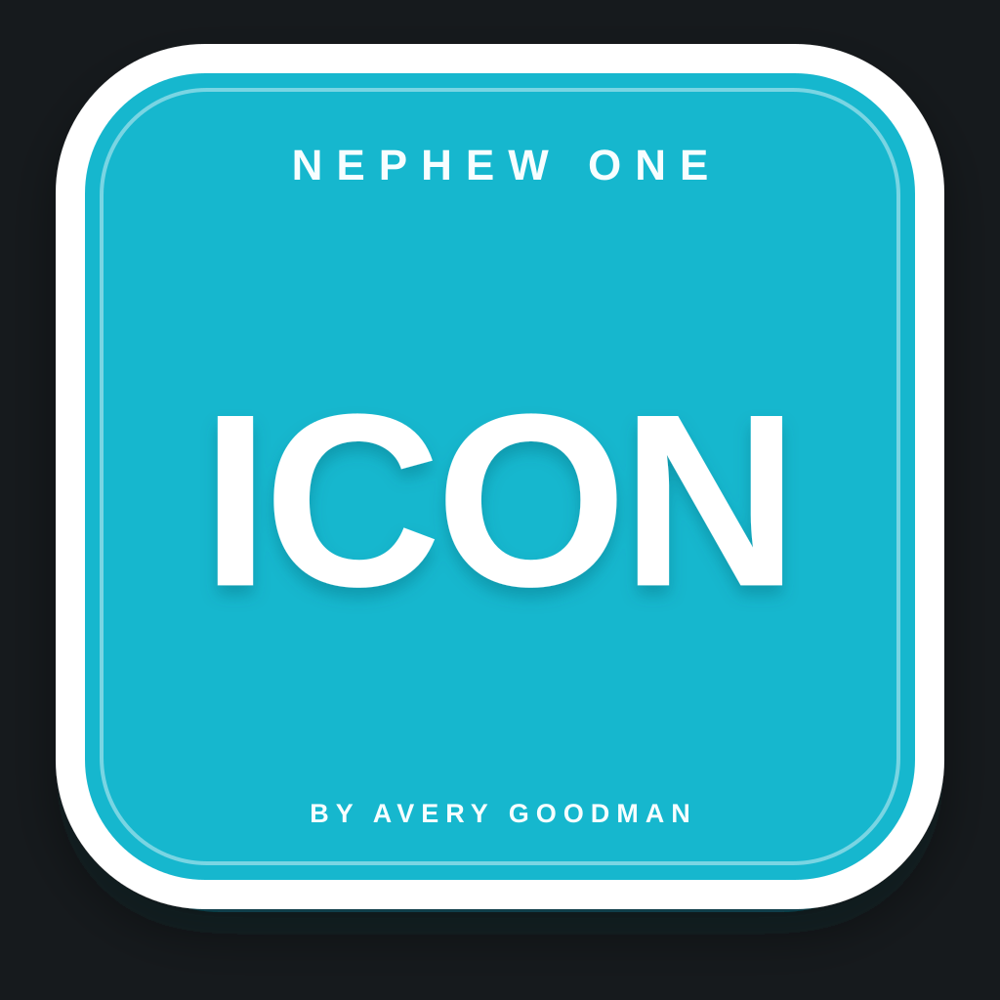

# Nephew One Icon

<p align="center">
  
</p>

**Nephew One Icon** is the dedicated Nephew One product/repository for the generic icon identity and icon-attire tooling.

This repository owns the cyan **NEPHEW ONE / ICON** identity. Product-specific siblings keep their own marks, for example Nephew One CMS keeps its mustard **CMS** identity.

## Canonical identity

```text
NEPHEW ONE

    ICON

BY AVERY GOODMAN
```

The canonical master is:

```text
assets/nephew-one-icon.svg
```

Generated delivery assets:

```text
assets/nephew-one-icon.png
assets/NephewOneIcon.icns
```

Identity rules are machine-readable in:

```text
brand.json
attire-pack.json
```

## Visual law

- solid Nephew cyan field;
- clean white outer border;
- small `NEPHEW ONE` supporting line at the top;
- large `ICON` centered horizontally and vertically;
- small `BY AVERY GOODMAN` supporting line at the bottom;
- no product-specific `CMS` mark in this repository.

The cyan field is intentionally its own product hue. Nephew One CMS remains mustard/gold.

## GitTalk

Repository identity and pull/reconcile contracts live in:

```text
gittalk/identity.json
gittalk/pull-main.json
```

The normal pull posture is fast-forward-only. A clean Git pull is not treated as proof that generated icon assets are current; verification remains explicit.

## Scope boundary

This initial repository commit establishes the canonical product home, identity source and delivery assets for Nephew One Icon. It does **not** invent unconfirmed application behavior merely because the product now has its own repository.

The app/runtime layer can grow from this identity without moving the canonical icon law again.
